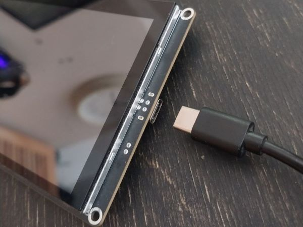
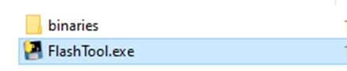
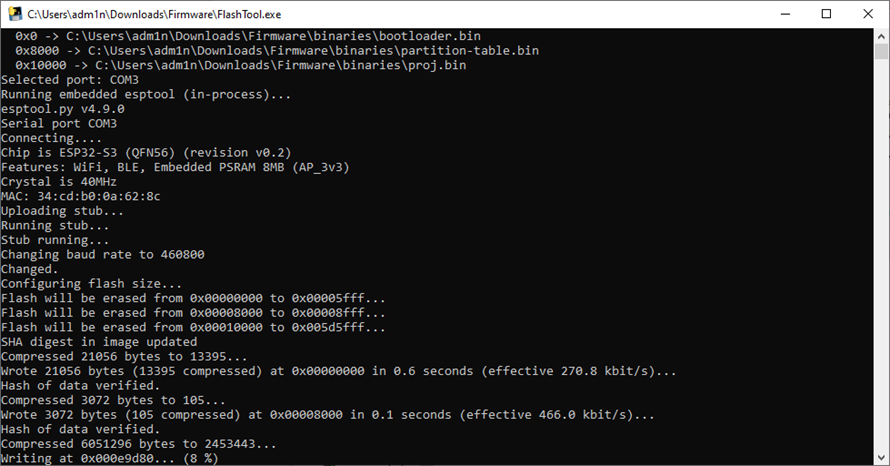
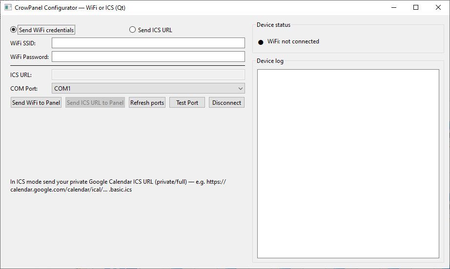
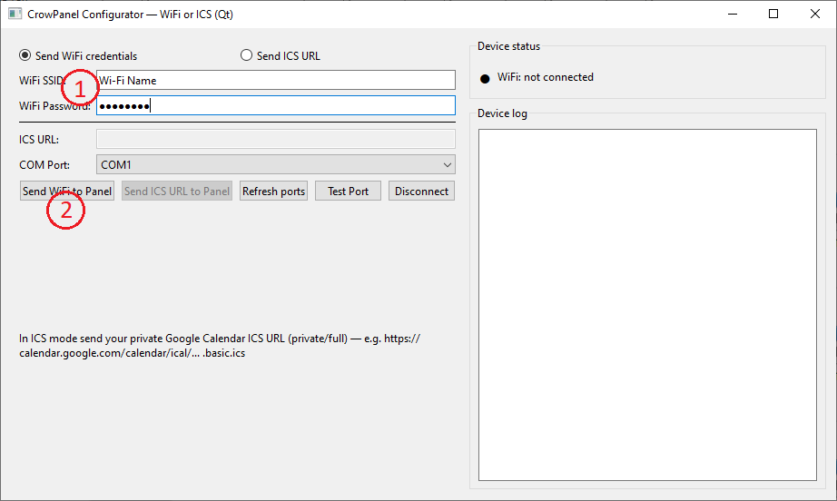
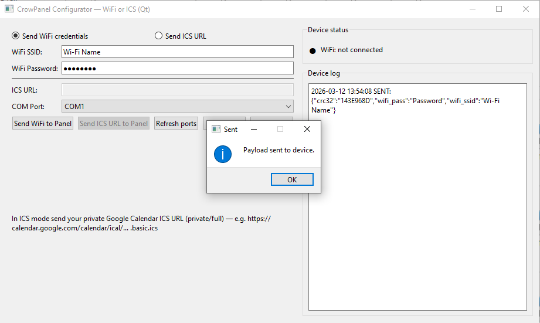
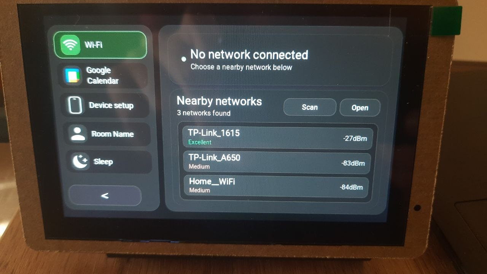
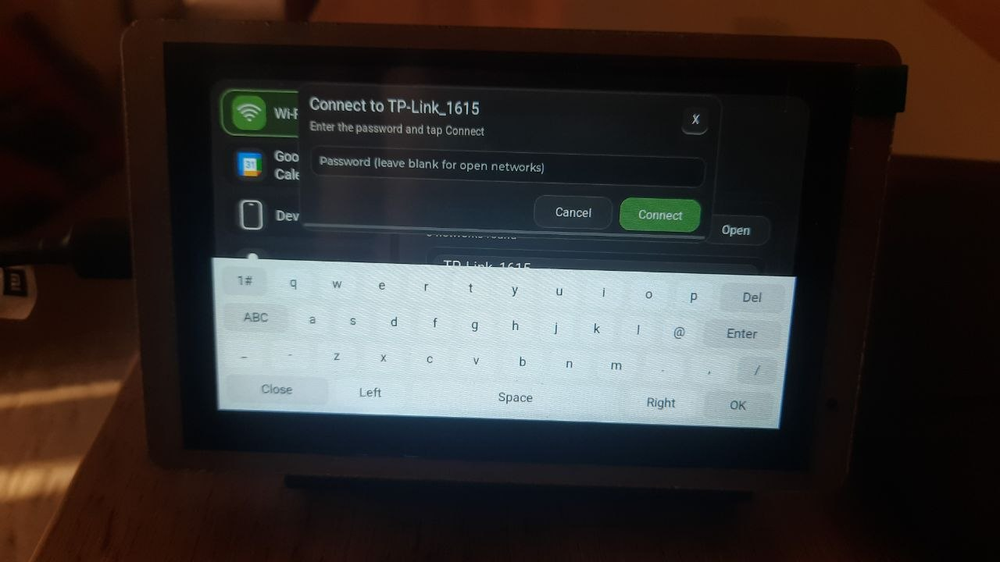
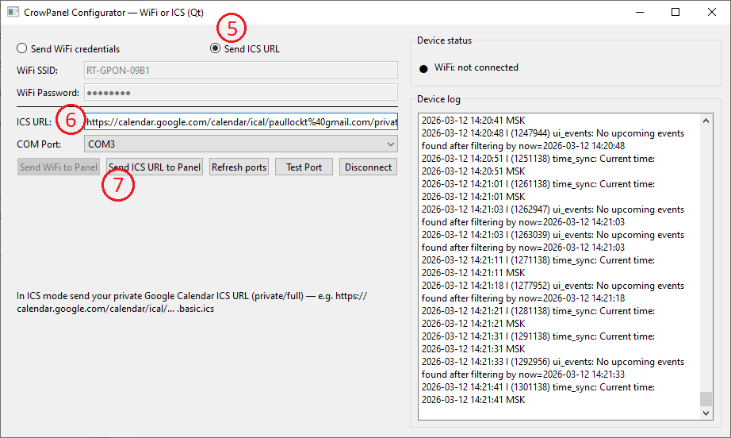

# Installation & Setup

There are two ways to install the Meeting Room Panel software.

---

## [1. Quick Installation (Recommended)](Installation_and_Setup.md#1-quick-installation-recommended)

Use the prebuilt firmware and installer.

This is the fastest way to test the system and takes only a few minutes.

---

## [2. Development Installation](Installation_and_Setup.md#2-development-installation-repository)

Clone the repository and build the firmware yourself.

This option is recommended if you plan to modify the project or integrate it into your own system.

## ⚡ Quick Installation

### Steps

1. Flash the firmware using **FlashTool.exe**.
2. Connect the panel to Wi-Fi using the configuration tool.
3. Add your Google Calendar ICS link.

### Flash the Firmware Using FlashTool.exe

1. Download the [Firmware.zip](https://github.com/Grovety/Meeting-Room/raw/main/Firmware.zip) archive.
2. Extract the archive.
3. Connect the **CrowPanel ESP32-S3** (5" or 7") to your PC using a **USB Type-C** cable.

---

**Note:** After connecting the CrowPanel to your PC, you should hear the Windows sound indicating that a new USB device has been detected.

You can also verify the connection in **Device Manager** by checking whether a new **COM port** appears.

If no new COM port is shown, you may need to install the **CP210x USB-to-UART Bridge VCP driver**, which Silicon Labs provides for Windows. Without this driver, **FlashTool** may not detect the device correctly. :contentReference[oaicite:0]{index=0}

If needed:

- Go to the [Silicon Labs CP210x VCP Drivers page](https://www.silabs.com/software-and-tools/usb-to-uart-bridge-vcp-drivers)
- Download the appropriate Windows driver
- Install it by following the vendor’s instructions
- Restart your computer
- Reconnect the board and check **Device Manager** again — it should now appear as a **COM port** :contentReference[oaicite:1]{index=1}

---

4. Run **FlashTool.exe** from the extracted folder and wait for the flashing process to complete.

---

---

 
---

Once the process is complete, the application will start automatically on the panel.

6. Close the installer window.
7. Restart the panel by disconnecting and reconnecting the USB cable.

## Application Setup

After installing the firmware, you need to configure the device.

### Steps

1. Connect the panel to Wi-Fi.
2. Link your Google Calendar.
3. (Optional) Connect the EnSens air quality module.

You can configure the panel using either the desktop application (see below) or a smartphone.

For smartphone setup instructions, see the [Smartphone Setup Guide](Setup_via_Smartphone.md).

## Application Setup with the Desktop Application

### Connect to Wi-Fi

1. Download the [CrowPanelConfigurator.exe](https://github.com/Grovety/Meeting-Room/raw/main/CrowPanelConfigurator.exe) application.
2. Run **CrowPanelConfigurator.exe**.  
   The configurator will open and automatically detect the panel’s COM port.

3. Enter your Wi-Fi credentials:
   - **SSID** (network name)
   - **Password**

   Then click **Send WiFi to Panel** to transfer the configuration to the panel.

The Wi-Fi settings are stored in the device’s non-volatile memory and will be used automatically on every boot.

You can also connect to Wi-Fi directly from the panel.

Tap the gear icon in the top-left corner of the main screen to open the settings menu.  
Select your Wi-Fi network from the list and enter the password using the on-screen touch keyboard.

### Connect Google Calendar (Optional)

To display events from Google Calendar:

1. Get the ICS link:
   - Open [Google Calendar](https://calendar.google.com/calendar/) on your PC.
   - Under **My calendars**, locate the calendar you want.
   - (1) Click the three dots **(⋮)** next to the calendar name.
   - (2) Select **Settings and sharing**.

   - (3) Scroll down to **Integrate calendar**.
   - (4) Copy the **Secret address in iCal format**.

2. Send the ICS link to the panel:
   - Open **CrowPanelConfigurator.exe**.
   - (5) Select **Send ICS URL**.
   - (6) Paste the ICS URL.
   - (7) Click **Send ICS URL to Panel**.

3. Open the **Calendar** screen on the panel and check that the events appear.

---

## 🐛 Troubleshooting

### Problem: **Screen does not turn on after flashing**

**Solution:**

- Check the USB cable connection.
- Make sure the flashing process completed without errors.
- Power-cycle the board.
- Repeat the flashing process if necessary.

---

### Problem: **Board is not detected as a COM port**

**Solution:**

- Make sure the CP210x driver is installed.
- Try a different USB cable.
- Restart your PC.
- Check **Device Manager** for unknown devices.

---

### Problem: **Wi-Fi does not connect**

**Solution:**

- Verify the Wi-Fi password.
- Use a 2.4 GHz Wi-Fi network (the ESP32-S3 does not support 5 GHz).
- Restart the board.

---

### Problem: **Calendar does not show events**

**Solution:**

- Make sure the ICS link was copied correctly.
- Check that the device has internet access.
- Confirm that the calendar contains events.
- Try sending the link again.

---