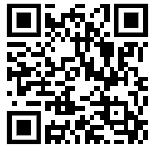
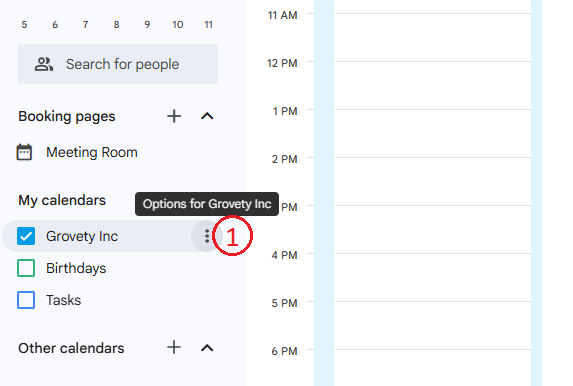
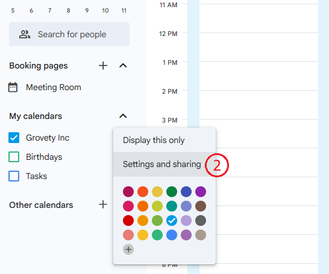
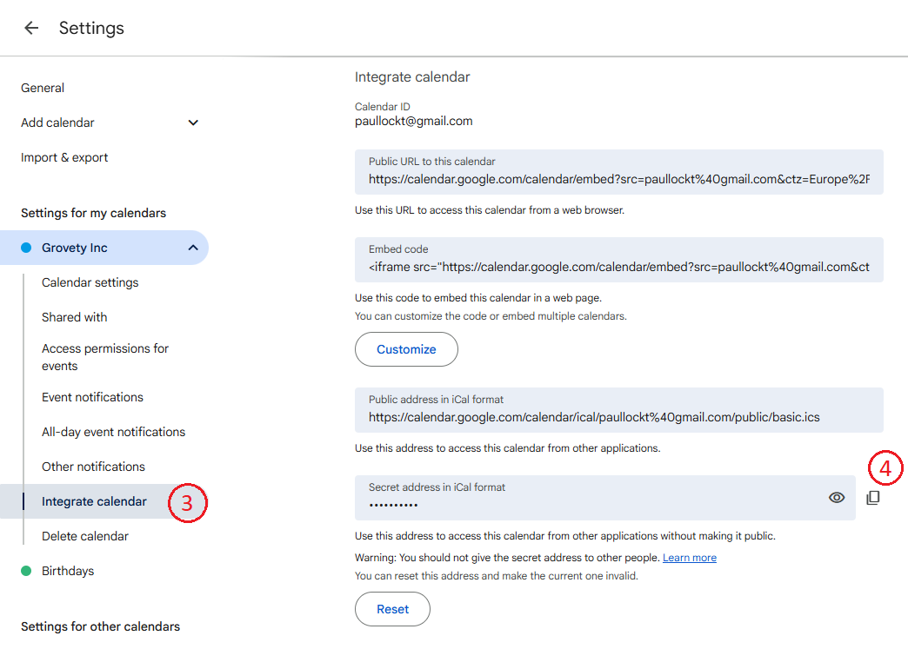
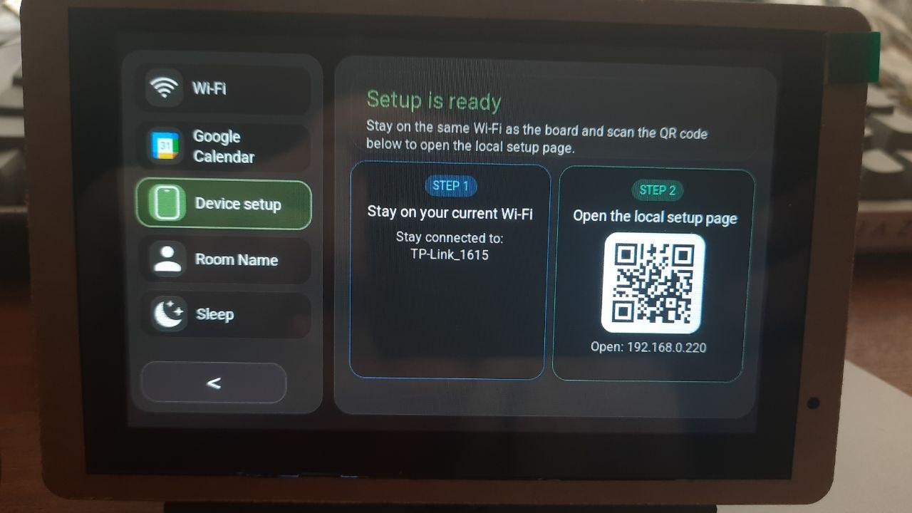
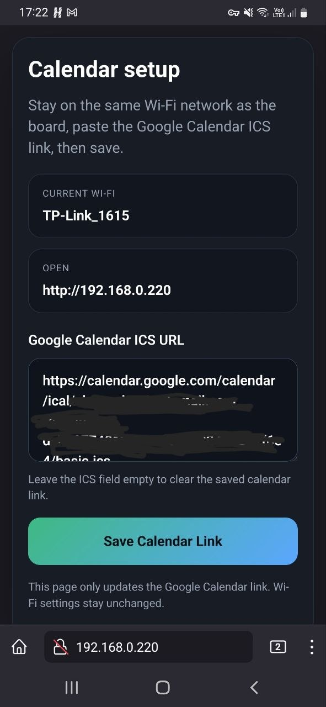

# Set up via Smartphone

_Wi-Fi connection and Google Calendar integration_

This guide describes how to set up the panel using a smartphone.
You can also configure the panel using a desktop application.

For the full setup guide and alternative methods, see the [Installation and Setup Guide](Installation_and_Setup.md).

## Step 1. Prepare Required Information

Before starting the setup, make sure you have:

- Your Wi-Fi network name (SSID) and password
- Your Google Calendar ICS URL

### How to copy the Google Calendar ICS URL

Open Google Calendar in a web browser (desktop mode), as the mobile app does not allow you to copy the ICS link.

[Google Calendar](https://calendar.google.com/calendar/)

#### Follow the steps to obtain the ICS link for your calendar

Under **My calendars**, locate the calendar you want.  
(1) Click the three dots **(⋮)** next to the calendar name.  
(2) Select **Settings and sharing**.
      
    

(3) Scroll down to **Integrate calendar**.  
(4) Copy the **Secret address in iCal format**.

___

## Step 2. Panel Setup

1. Tap the gear icon in the top-right corner of the panel to open **Settings**.
2. Select **Setup Portal**.
3. Select your Wi-Fi network from the list and enter the password using the on-screen keyboard.
4. Tap **Device setup**.
5. Scan the second QR code.

6. In the **Google Calendar ICS URL** field, paste the calendar link you copied earlier.
7. Save the calendar link.

